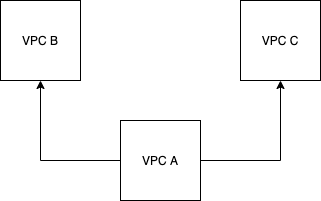
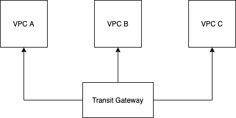
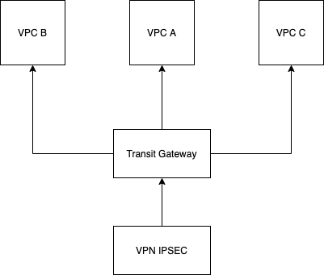
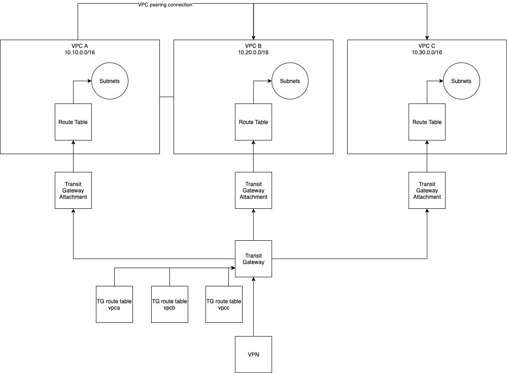

# tf_network

Este projeto tem a intenção de avaliar e mostrar ao candidato as ferramentas e trabalhos executados no dia a dia de trabalho.

**Índice**
   * [Sobre o desafio](#Sobre-o-desafio)
   * [Estrutura](#Estrutura)
   * [Como usar](#como-usar)
      * [Pre Requisitos](#Pre requisitos)
      * [Rodando o código](#Rodando-o-código)

***

## Sobre o desafio

**Objetivos**
**1. Criar uma estrutura básica de rede usando 3 VPCs.**
  * Criar as VPCs usando os respectivos blocos
    * VPC A - 10.10.0.0/16
    * VPC B - 10.20.0.0/16
    * VPC C - 10.30.0.0/16
  * Cada VPC precisa ser segmentada em 3 tipos de tráfego
    * Public - subnet que pode receber acessos públicos vindo da internet.
    * Private - subnet que irá alocar os servidores de aplicações.
    * Database - subnet que irá alocar os servidores de banco de dados.
  * Cada subnet precisa ter 4 AZ (Availability Zones - São locais distintos dentro de uma região classificadas como A,B,C e D).
    * subnet-pb (Public) 
      * subnet-pb-a 
      * subnet-pb-b 
      * subnet-pb-c
      * subnet-pb-d
    * subnet-pv (Private) 
      * subnet-pv-a 
      * subnet-pv-b 
      * subnet-pv-c 
      * subnet-pv-d
    * subnet-db (Database) 
      * subnet-db-a 
      * subnet-db-b 
      * subnet-db-c 
      * subnet-db-d
  * Cada VPC precisa ter 2 tabelas de roteamento
    * Tabela roteamento pública
      * subnet-pb-a 
      * subnet-pb-b 
      * subnet-pb-c 
      * subnet-pb-d
    * Tabela roteamento privada 
      * subnet-pv-a
      * subnet-db-a 
      * subnet-pv-b 
      * subnet-db-b 
      * etc
      
**2. Criar a comunicação entre as VPC usando VPC Peering**
  * Fluxograma
    
      
    
    * Parâmetros desejados
     * VPC A fala com VPC B e C
     * VPC B fala com VPC A
     * VPC C fala com VPC A
     * VPC B e C não podem se falar

**3. Criar a comunicação entre as VPC usando Transit-Gateway**
  * Fluxograma

      
    
   * Parâmetros desejados
     * VPC A fala com VPC B e C
     * VPC B fala com VPC A e C
     * VPC C fala com VPC A e B

**4. Criar a comunicação entre as VPC usando Transit-Gateway com controle de tráfego**
  * Mesmo que o Step 3 com tabelas de roteamento diferentes para cada VPC
  * Criar a comunicação entre as VPC usando Transit-Gateway
     * Criar 3 tabelas de roteamento no transit-gateway (uma para cada VPC)
     * VPC A fala com VPC B e C
     * VPC B fala com VPC A
     * VPC C fala com VPC A
     * VPC B e C não podem se falar
   
**5. Criar uma VPN IPSEC com um ponto remoto e a VPC A**
  * Fluxograma
   
    
    
***

## Estrutura




## Como usar

### Pre Requisitos

Antes de começar, você vai precisar ter o [Terraform](https://www.terraform.io/) instalado em sua máquina e uma conta na [AWS](https://aws.amazon.com/pt/)com variável de ambiente configurada.
Além disto é bom ter um editor para trabalhar com o código como o [Visual Studio Code](https://code.visualstudio.com/)

### Rodando o código

```bash
Clone este repositório
$ git clone <https://github.com/gersonborgesbatista/tf_network.git>

Acesse a pasta do projeto no terminal
$ cd tf_network

Inicie o terraform
$ terraform init

Verifique as configurações antes de executar efetivamente
$ terraform plan

Execute o código
$ terraform apply
```


      
